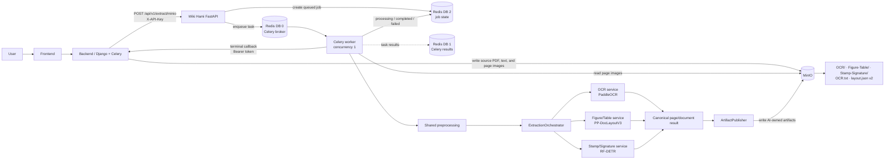
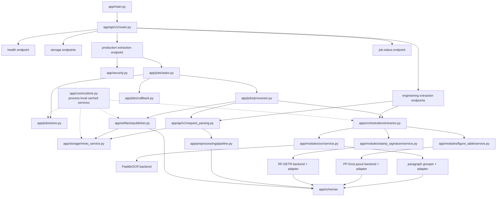
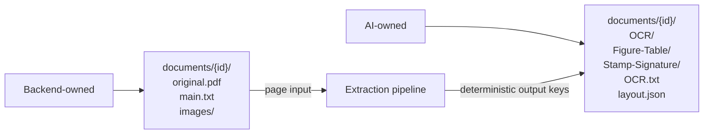

# Extraction V1 Architecture Graph

This is the visual companion to [architecture.md](architecture.md). It reflects the
asynchronous production path and the current `app/` module boundaries.

## Production runtime

The API returns `202 Accepted` after queueing. Model inference and artifact
publication happen in the worker. A callback failure does not change an otherwise
completed extraction to failed; the Backend can reconcile through the job-status API.

## Internal code map

Solid arrows show request/data-flow dependencies. Dotted arrows show the
process-local service registry constructing and caching shared components.

## Artifact ownership

The pipeline may replace only AI-owned outputs. Public object geometry is expressed
in `exif_corrected_source_pixels`; adapters restore model-space detections to that
coordinate system before creating canonical detected objects.
